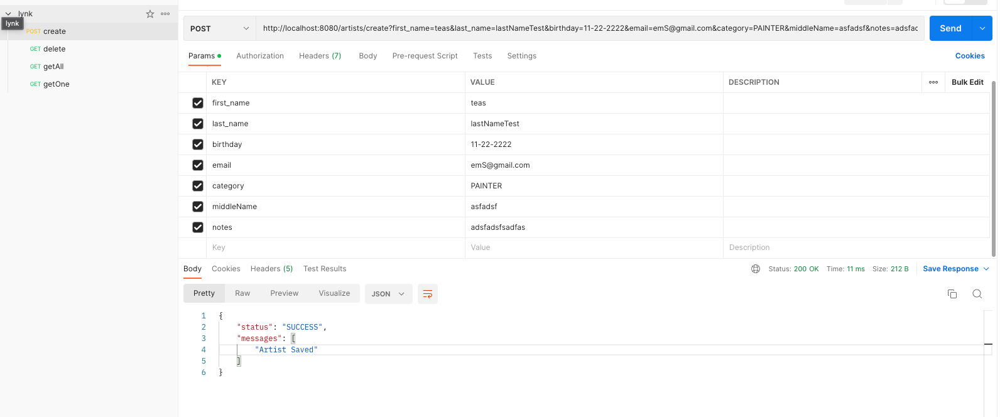
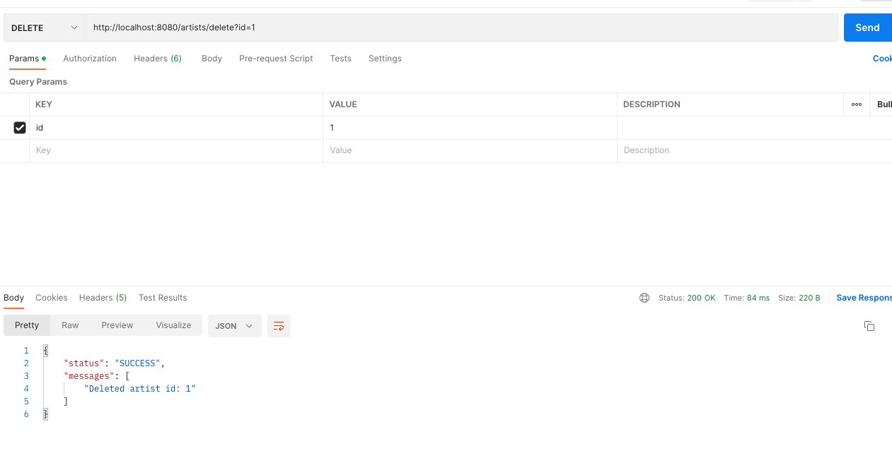
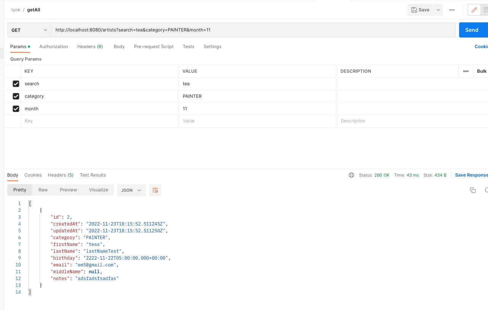
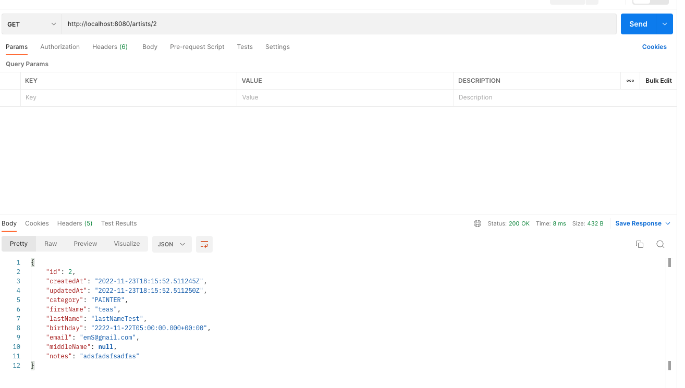

# Backend Engineering Challenge

Welcome Candidate and thank you for taking the time to complete the take-home challenge for our backend engineer position

Once you have completed your solution, please reply with a link to a github repository and instructions on how to install / run the application

Good luck and if you have questions, please reach out to us at **soroush@trylynk.com**

---

1) Make sure you have min Java 11 installed.
2) Run `./gradlew build` to build the api and dependencies. To start the API server, run `./gradlew bootrun`. (You can also use IDE commands for build/running if you wish)

# Overview
This exercise is to implement the best possible solution to the exercise below. 
We're evaluating your ability to take a set of requirements and spike a holistic solution that 
demonstrates craftsmanship, thoughtfulness and good architectural 
design. If you want to impress us, build something that is beautiful, 
highest performant, intuitive and easy to debug/test/extend 😃 .
Extra points if you can also add tests

Ideally your solution would have some way to run locally so we can fully analyze your efforts.

# Exercise
Design and implement a Java REST API that CRUDs artists.
###### Authentication/Authorization is not required.

** A boilerplate model, controller and repository has been created for you **

### Each artist object consists of following (but not limited):

- first_name (required)

- middle_name

- last_name (required)

- category (Can be one of ACTOR | PAINTER | SCULPTOR) (required)

- birthday (required)

- email (required)

- notes

###Notes:

- The request and response should both be in JSON format

- You can use the provided in-memory DB (H2)

- Creation route should validate for required parameters (ex. if last_name not given or blank it should throw an error)

- Filters should be case insensitive (ex. /artists?category=actor is the same as /artists?category=ACTOR)

### The API should have the following:

               - GET         /artists/:id     (Show)
               - GET         /artists         (Index)
               - POST        /artists         (Create)
               - DELETE      /artists/:id     (Delete)
- Getting a list of artists should be filterable. Ability to Filter by **category, birthday-month, search** (search -> can search by first_name or last_name, it should also partial search, ex. given search=vin should bring up kevin, if we have a kevin in the system) , you should also be able to filter by one, or more filters, for example search and category
- Try to make sure your solution is the best performant, you can make any changes/additions you like to DB schema/indexes, application.properties, or any spring/java classes
- **Assume** that we have a big collection of artists in the DB, make sure things are performant based on that assumption

# Using the APIs
We can start up the application either using an IDE or using `./gradlew bootrun`
I personally used postman the call the apis. The parameters are named the same as the requirements
given above
Creating artist:

Deleting artist:

Getting all artist: (with filters)

Getting single artist: Using a path variable for this one
